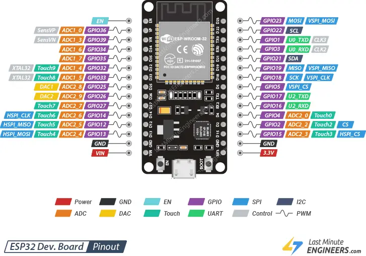
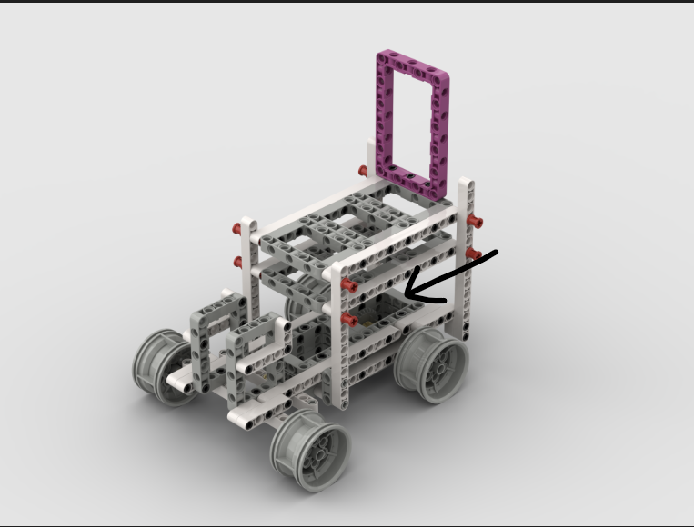

<center><h1> The Statesmen 2025 </center>

This repository contains all of the documentation for team The Statesmen in the World Robot Olympiad 2025, Future Engineers category. This README.md file is the engineering notebook.
<!-- It is preferred to view this document [here](https://github.com/WRO-Team-TheStatesmen/wro2025-fe-statesmen/blob/main/README.md) -->

## Table of Contents
* [Our Team](#our-team)
  * [Atharv Baluja](#atharv-baluja)
  * [Arham Jain](#arham-jain)
  * [Yashvardhan Surana](#yashvardhan-surana)
* [Robot Photos](#robot-photos)
* [Robot Videos](#robot-videos)
  <!-- * [Open Challenge](#open-challenge---default-setup)
  * [Obstacle Challenge](#obstacle-challenge---setup-1) -->
* [Mobility Management](#mobility-management)
  * [Motor](#motor)
  * [Motor Driver](#motor-driver)
  * [Rear Wheel Drive](#rear-wheel-drive)
  * [Servo Motor](#servo-motor)
  * [Ackermann Steering System](#ackermann-steering-system)
  * [Robot Chassis](#chassis)
  * [Code Snippets](#code-snippets)
  * [Problems Faced and Solutions](#problems-we-faced-and-how-we-solved-them)
  * [Possible Improvements](#possible-improvements)
* [Power and Sense Management](#power-and-sense-management)
  * [Li-Ion Battery](#li-ion-battery)
  * [Buck Convertor](#lm2596-buck-converter)
  * [Power Bank](#power-bank)
  * [ESP32](#esp32-devkit-sbm)
  * [Raspberry Pi 4](#raspberry-pi-4-sbc)
  * [Camera](#camera)
  * [TF Luna LiDAR Sensor](#tf-luna-lidar-sensor)
  * [BNO055 Orientation Sensor](#bno055-orentiation-sensor)
  * [Power System Connections](#connection-diagram-for-power-system)
  * [Sensor Connections](#connection-diagram-for-sensors)
  * [Code Snippets](#code-snippets-for-components)
  * [Problems Faced and Solutions](#problems-we-faced-and-how-we-solved-them-1)
  * [Possible Improvements](#potential-improvements)
* [Obstacle Management](#obstacle-management)
  * [Open Challenge](#open-challenge)
  * [Obstacle Challenge](#obstacle-challenge)
* [Engineering Factor](#engineering-factor)
* [Robot Construction Guide](#robot-construction-guide)

## Our Team

### Team Photo


### Atharv Baluja
<strong>Age: </strong>14

<strong> School: </strong> Neerja Modi World School

<strong>Description: </strong>
Hey! I am Atharv. I'm a high school freshman from Jaipur, India. This is my second WRO seaon. Last year, I had participated in the Future Innovator category. This year, I wanted a bigger challenge so I am participating in the Future Engineers category. I am working on the software of the robot.


### Arham Jain
Hello, I am Arham, an 11th-grade student at Neerja Modi School. I have competed in WRO once before in the Future Innovators category two years ago. I was preparing to compete in the Future Engineers category last year before some hurdles derailed my progress. Building on the knowledge and research from last year, I hope to put my effort into the Future Engineers Category again.


### Yashvardhan Surana
Hello, I'm Yash. I am a 9th grader from Jaipur. This is my second time participating in WRO. Last year, I had participated in the Future Innovators category. This year, I'm taking part in the Future Engineers category in the team The Statesmen. In The Statesmen, I am in charge of the hardware of the robot.


## Robot Photos
|  |  | 
| :--: | :--: | 
| *Front View* | *Back View* |
|  |  | 
| *Top View* | *Bottom View* |
|  |  | 
| *Left View* | *Right View* |

## Robot Videos
### Open Challenge - Default Setup
<video width="640" height="360" controls>
  <source src="./other/README-images/RunVideos/OpenChallenge1.mp4" type="video/mp4">
  Your browser does not support the video tag.
</video>

If the video is not loading for you, you can view it [here](https://youtu.be/yJYID6W3fv8)

### Open Challenge - 1 Side Extended
<video width="640" height="360" controls>
  <source src="./other/README-images/RunVideos/OpenChallenge2.mp4" type="video/mp4">
  Your browser does not support the video tag.
</video>

If the video is not loading for you, you can view it [here](https://youtu.be/VSAF0O4e32w)

### Open Challenge - 2 Sides Extended
<video width="640" height="360" controls>
  <source src="./other/README-images/RunVideos/OpenChallenge3.mp4" type="video/mp4">
  Your browser does not support the video tag.
</video>

If the video is not loading for you, you can view it [here](https://youtu.be/7XdKwXTz3Lk)

<!-- ### Obstacle Challenge - Setup 1 -->
You can watch all the videos on our [youtube channel](https://www.youtube.com/@TheStatesmen-fe)

## Mobility Management
Our robot's mobility is managed by multiple components - a BO DC motor, L293D motor driver, an MG90 servo motor connected to a Ackermann steering geometry, and a rear differential. All of these seamlessly work together to achieve efficient movement.

### Motor
Aftering considering multiple motors, we finally settleed on a DC BO motor. We considered factors like speed (RPM), torque (kg cm), weight (g), required voltage (v), and current consumption (mA).

<table>
  <tr>
    <td width="50%" style="text-align: left;">
      
    </td>
    <td width="50%" style="text-align: left; vertical-align: top;">
      <h3>Specifications:</h3>
      <li>Voltage: 12V</li>
      <li>Gear Ratio: 1:50</li>
      <li>Speed: 400 ± 20% rpm</li>
      <li>Rated Torque: 0.35 kg·cm</li>
      <li>Weight: 28g</li>
      <li>No Load Current Consumption: 40-180 mA</li>
      </li>
    </td>
  </tr>
</table>

You can buy this motor [here](https://robu.in/product/300-rpm-bo-motor-straight)

To connect this motor to a Lego-compatible axle, we 3D-printed a custom adapter

<table>
  <tr>
    <td width="50%" style="text-align: left;">
      
    </td>
  </tr>
</table>

This is a female-to-female adapter

### Motor Driver
At first, we used the L298N Dual H-Bridge motor driver. The problem with that was that it was big because of the heatsink and the module wasn't built efficiently. After evaluating more options, we settled on the L293D motor driver. This is just like the L298N but is a small IC instead of a big module.

<table>
  <tr>
    <td width="50%" style="text-align: left;">
      
    </td>
    <td width="50%" style="text-align: left; vertical-align: top;">
      <h3>Specifications:</h3>
      <li>Type: Dual H-Bridge</li>
      <li>Power Supply Voltage: 4.5v to 36v</li>
      <li>Logic Voltage: 4.5v to 7v</li>
      <li>2 DC Motors</li>
      <li>Internal ESD Protection</li>
      </li>
    </td>
  </tr>
</table>

We are using the following pin connections for the motor driver:
<ol>
<li>Enable 1,2 - For PWM speed control of motor A</li>
<li>Input 1 - Direction control pin 1 for motor A</li>
<li>Output 1 - Connected to one terminal of motor A</li>
<li>GND - Ground</li>
<li>GND - Ground</li>
<li>Output 2 - Connected to other terminal of motor A</li>
<li>Input 2 - Direction control pin 2 for motor A</li>
<li>VCC 2 - Power supply (+)</li>
<li>Enable 3,4 - For PWM speed control of motor B</li>
<li>Input 3 - Direction control pin 1 for motor B</li>
<li>Output 3 - Connected to one terminal of motor B</li>
<li>GND - Ground</li>
<li>GND - Ground</li>
<li>Output 4 - Connected to other terminal of motor B</li>
<li>Input 4 - Direction control pin 2 for motor B</li>
<li>VCC 1 - Power Supply (+) for logic</li>
</ol>

### Rear Wheel Drive
We have achieved RWD with the motor connected to a lego rear differential. We have used the lego parts to minimize friction.

<table>
    <td width="50%" style="text-align: left;">
      
    </td>
    <td width="50%" style="text-align: left;">
      
    </td>
</table>


### Servo Motor
We are using an ackermann steering geometry to steer the robot. This system runs with an MG90 servo motor.

<table>
  <tr>
    <td width="50%" style="text-align: left;">
      
    </td>
    <td width="50%" style="text-align: left; vertical-align: top;">
      <h3>Specifications:</h3>
      <li>Angle Constaint: 0° to 360°</li>
      <li>Input Voltage: 4.8v to 6v</li>
    </td>
  </tr>
</table>

Here is the pinout of the MG90 Servo Motor:
<ol>
<li>VCC - Red Wire - 5V</li>
<li>Signal - Orange Wire - PWM</li>
<li>Ground - Black Wire - GND</li>
</ol>

To connect the servo motor to the steering geometry, we created a 3D-printed adapter which converted the servo rotor into a lego compatible axle.

<table>
  <tr>
    <td width="50%" style="text-align: left;">
      
    </td>
  </tr>
</table>

It is a female-to-female adapter.

### Ackermann Steering System

We are using the Ackermann steering system. This system allows the front 2 wheels to turn at different angles, allowing for sharper turns and decreasing friction due to drag.

<table>
  <tr>
    <td width="50%" style="text-align: left;">
      
    </td>
  </tr>
  <tr>
    <td width="50%" style="text-align: left;">
      
    </td>
  </tr>
</table>


### Chassis
#### Photos
|  |  | 
| :--: | :--: | 
| *Orthographic View 1* | *Orthographic View 2* |
|  |  | 
| *Top View* | *Bottom View* |
|  |  | 
| *Left View* | *Right View* |


#### Assembly Guide

<embed src="./other/README-images/Chassis/ChassisAssembly.pdf" type="application/pdf" width="100%" alt="Chassis Assembly Guide PDF"> </embed>

If the PDF is not loading properly, you can view the guide [here](https://github.com/WRO-Team-TheStatesmen/wro2025-fe-statesmen/blob/main/other/README-images/Chassis/ChassisAssembly.pdf)

### Connection Diagram for Mobility System
<table>
  <tr>
    <td width="50%" style="text-align: left;">
      
    </td>
  </tr>
</table>

### Code Snippets
#### Running the L293D Motor Driver with an ESP32 Devkit
```
// Program for running the motors via the L293D motor driver IC on an ESP32 devkit

#define IN1 13
#define IN2 12
#define ENA 14

void setup() {
  pinMode(IN1, OUTPUT);
  pinMode(IN2, OUTPUT);
  pinMode(ENA, OUTPUT);
}

void loop() {
  // Forward
  digitalWrite(IN1, HIGH);
  digitalWrite(IN2, LOW);
  analogWrite(ENA, 255);
  delay(2000);

  // Stop
  analogWrite(ENA, 0);
  delay(1000);

  // Backwards
  digitalWrite(IN1, LOW);
  digitalWrite(IN2, HIGH);
  analogWrite(ENA, 255);
  delay(2000);

  // Stop
  analogWrite(ENA, 0);
}
```

#### Running the MG90 Servo Motor with an ESP32 Devkit
```
// Program for rotating the steering MG90 servo motor connected to an ESP32 devkit [signal pin = 25]

const int servoPin = 25;
const int servoCenter = 138; // Servo center is the position of the servo at which the steering system is centered

void moveServoAngle(int angle){
  angle = constrain(angle,0,180);
  int pulsewidth = map(angle,0,180,500,2400);
  digitalWrite(servoPin, HIGH);
  delayMicroseconds(pulsewidth);
  digitalWrite(servoPin, LOW);
  delay(20 - pulsewidth/1000);
}

void steer(int angle) {
  moveServoAngle(servoCenter + angle);
}

void setup() {
  pinMode(servoPin, OUTPUT);
}

void loop() {
  steer(0);
  delay(1000);
  steer(30);
  delay(1000);
  steer(0);
  delay(1000);
  steer(-30);
  delay(1000);
}
```

### Problems We Faced and How We Solved Them
<ol>
<li> <strong>Bot Rear Skidding: </strong> At first, we were not using a rear differential but rather the motor connected to a gear which rotated a single axle which both the wheels were on. There was a huge problem with this. As shown in the image below, both wheeels have to move a different distance.<br><br>

<table>
  <tr>
    <td width="50%" style="text-align: left;">
      
    </td>
  </tr>
</table>

To fix this, we added the <strong>Rear Differential</strong>. This allows the 2 wheels to move at different speeds while only using one motor.
</li>
<li> <strong>Bot Front Skidding: </strong> At first, we were using a parallel steering geometry. The same problem occurred. There was a lot of friction and drag. This limited the maximum turning angle of the robot.
<br><br>


As you can see, in this system, both the wheels are turned equally. This does not achieve peak efficiency. That is why we switched to the ackermann system.
</li>

<li>
<strong>Axle Sliiping Out of Differential</strong>

Initially, the axle used in the differential was too small. Because of vibrations, it often slipped out of the differential, which caused the gears to come out and completely ruined the robot's movement. If we used longer axles, it would stick out of the robot and could touch other blocks.

To fix this, we did two things. Firstly, we structured the chassis of the robot since there were some redundant pieces. We also switched out the rear tyres to the normal blue tyres since it would fix the problem without causing a significant change in the movement of the robot.
</li>

<li>
<strong>No Exact Piece for Ackermann</strong>: While trying to create the ackermann steering geometry, we noticed that no single piece could create the steering geometry. At first, we used this piece:


However, using this caused a problem that the robot wasn't fully level. After trying out multiple options, we finally settled on joining 2 pieces to achieve this:


With this, we encountered another problem. If we tried to turn it more than 40 degree, it would cause a lot of tension and the 2 pieces would disconnect. To increase the maximum turning angle to 60 degrees, we had to superglue the 2 pieces together.
</li>
</ol>

### Possible Improvements
<ol>
<li><strong>Using a Higher RPM Motor</strong> so that the robot can move faster</li>
<li><strong>Using a Motor with an Encoder</strong> so that the robot movements become more accurate and precise</li>
<li><strong>Using Metal Gears for the Rear Differential</strong> so that it can withstand higher speeds</li>
<li><strong>Using a Heat Sink or Active Cooling for the Motor Driver</strong> so that it doesn't get too hot much while being used</li>
<li><strong>Using Four-Wheel Drive</strong> for better movement</li>
<li><strong>Using a Custom Gearbox</strong> instead of relying on the BO motor's gear ratio to create an optimized gear ratio</li>
</ol>

## Power and Sense Management
Our robot uses an 11.1v Li-ion Battery and a 5V 3A 10,000 mAh power bank for power with a buck converter. An ESP32 Devkit single board microcontroller is used with a Raspberry Pi 4 single board computer. Along with this, 3 TF Luna LiDAR sensors (one at the left, one at the front, and one at the back) are used for disance measurement and a BNO055 orientation sensor to measure the rotation.

### Li-Ion Battery
We are using an 11.1v Li-ion battery pack
<table>
  <tr>
    <td width="50%" style="text-align: left;">
      
    </td>
    <td width="50%" style="text-align: left; vertical-align: top;">
      <h3>Specifications:</h3>
      <li>Voltage: 11.1V</li>
      <li>Capacity: 2200mAh</li>
      <li>Discharge Rate: 2C</li>
      <li>Maximum Current: Capcity x Discharge Rate = 4.8A</li>
    </td>
  </tr>
</table>

This battery pack consists of 3 18650 3.7v Li-ion cells

This battery powers the motors, ESP32, and all the sensors

You can buy this battery [here](https://www.amazon.in/2200MAH-Rechargeable-Battery-Robotics-Vehicle/dp/B0DNZJ7823/)

### LM2596 Buck Converter
We are using an 11.1v battery, but the ESP32 requires 5v to be provided to it. To convert the 11.1v to 5v, we are using an LM2596 DC-DC Buck Converter

<table>
  <tr>
    <td width="250x" style="text-align: left;">
      
    </td>
    <td width="500px" style="text-align: left; vertical-align: top;">
      <h3>Specifications:</h3>
      <li>Supply Voltage: 3v - 40v</li>
      <li>Output Voltage: 1.5v - 35v (adjustable) --> Set to 5v for us</li>
      <li>Output Current: Rated 2A, Maximum 3A</li>
      <li>Switching Frequency: 150KHz</li>
      <li>Conversion Efficiency: 92%</li>
    </td>
  </tr>
</table>

You can buy the LM2596 Buck Converter [here](https://robu.in/product/lm2596s-dc-dc-buck-converter-power-supply/)

### Power Bank
We are using a 10,000 mAh power bank to power the Raspberry Pi. This power bank gives a 5V output at 3A, as required by the Raspberry Pi.

### ESP32 Devkit SBM
We are using an ESP32 Devkit single board microcontroller.

<table>
  <tr>
    <td width="250x" style="text-align: left;">
      
    </td>
    <td width="500px" style="text-align: left; vertical-align: top;">
      <h3>Specifications:</h3>
      <li>Supply Voltage: 5v</li>
      <li>Power Consumption: 150mA - 250mA</li>
      <li>GPIO Pins: 25</li>
      <li>Clock Speed: 240MHz</li>
      <li>Flash Memory: 4 MB</li>
      <li>SRAM: 520 KB</li>
    </td>
  </tr>
</table>

We chose this microcontroller over others because of its high clock speed and processing power.

Here is the pinout diagram for this ESP32:



### Raspberry Pi 4 Model B SBC
We are using the Raspberry Pi 4 Model B 8 GB RAM single board computer. We have chosen this after considering multiple options. We ended up on this one because of its cost and technical specifications mentioned below.

<table>
  <tr>
    <td width="250x" style="text-align: left;">
      
    </td>
    <td width="500px" style="text-align: left; vertical-align: top;">
      <h3>Specifications:</h3>
      <li>Supply Voltage and Current (Optimal): 5.1v at 3A</li>
      <li>Supply Voltage and Current (Minimum): 5v ± 0.25v at 2.5A</li>
      <li>CPU: Broadcom BCM2711 Quadcore Cortex-A72 - 64-bit SoC @ 1.8GHz</li>
      <li>RAM: 8GB</li>
      <li>USB Type A Ports: 4</li>
      <li>GPIO Pins: 28</li>
    </td>
  </tr>
</table>

Here is the pinout of the Raspberry Pi 4 Model B


### Camera
We are using the FINGERS 1080p Hi-Res camera. We chose this camera after considereing multiple factors like its field of view, high resolution, and color saturation.

<table>
  <tr>
    <td width="250x" style="text-align: left;">
      
    </td>
    <td width="500px" style="text-align: left; vertical-align: top;">
      <h3>Specifications:</h3>
      <li>Power Consumption: 200mA</li>
    </td>
  </tr>
</table>

### TF Luna LiDAR Sensor
We are using the TF-Luna LiDAR sensor to find the distances from the robot to the walls. We chose this sensor because of its speed, accuracy, and range.

<table>
  <tr>
    <td width="250x" style="text-align: left;">
      
    </td>
    <td width="500px" style="text-align: left; vertical-align: top;">
      <h3>Specifications:</h3>
      <li>Supply Voltage: 5v</li>
      <li>Power Consumption: 70mA</li>
      <li>Range: 8m</li>
      <li>Resolution: 1cm</li>
      <li>Communication Protocol: I2C / UART</li>
      <li>Ranging Frequency: 1 to 250 Hz (100 Hz by default)</li>
  </tr>
</table>

Here is the pinout of the TF Luna LiDAR sensor:
<ul>
<li>Pin 1 - VCC (3.7v to 5.2v)</li>
<li>Pin 2 - RX (UART) or SDA (I2C)</li>
<li>Pin 3 - TX (UART) or SCL (I2C)</li>
<li>Pin 4 - GND</li>
<li>Pin 5 - CFG</li>
<li>Pin 6 - MUX</li>
</ul>

By default, it uses the UART communication protocol. However, if we connect the CFG pin to ground, it uses the I2C protocol. We are using the UART protocol. UART works by sending asynchronus data without the use of a clock signal. It uses a start and stop bit.

To connect this sensor to a Lego part, we 3D-printed a custom mount

<table>
  <tr>
    <td width="50%" style="text-align: left;">
      
    </td>
  </tr>
</table>

This is a female-to-female adapter

### BNO055 Orentiation Sensor
We are using the BNO055 Absolute Orientation Sensor. This sensor contains an accelerometer, a gyroscope, and a geomagnetic sensor. We chose this sensor after considering factors such as accuracy and weight.

<table>
  <tr>
    <td width="250x" style="text-align: left;">
      
    </td>
    <td width="500px" style="text-align: left; vertical-align: top;">
      <h3>Specifications:</h3>
      <li>Supply Voltage: 3.3v or 5v</li>
      <li>Power Consumption: ~12.3mA</li>
      <li>Communication Protocol: I2C</li>
  </tr>
</table>

Here is the pinout of the BNO055 sensor:
<ul>
<li>Pin 1 - VCC (5v)</li>
<li>Pin 2 - VCC (3.3v)</li>
<li>Pin 3 - GND</li>
<li>Pin 4 - SDA</li>
<li>Pin 5 - SCL</li>
<li>Pin 6 - RST</li>
</ul>

### Connection Diagram for Power System
<table>
  <tr>
    <td width="50%" style="text-align: left;">
      
    </td>
  </tr>
</table>

### Connection Diagram for Sensors
<table>
  <tr>
    <td width="50%" style="text-align: left;">
      
    </td>
  </tr>
</table>

We connected the third TF Luna to the Raspberry Pi. This is because of two reasons:
1. The ESP32 only supports 2 UART connections (excluding the USB port serial)
2. The ESP32 fully handles the open challenge, which requires just the right and left LiDAR. For the obstacle challenge, it merely acts as a node between the sensors and the Raspberry Pi. The third TF Luna is directly connected to the Raspberry Pi.

### Code Snippets for Components
#### Running 2 TF Luna Sensors with an ESP32 Devkit
```
// Program to get data from 2 TF-Luna LiDAR sensors connected to the ESP32 via UART connections

HardwareSerial tfLuna1(1);
HardwareSerial tfLuna2(2);

void setup() {
  Serial.begin(115200);
  delay(500);

  tfLuna1.begin(115200, SERIAL_8N1, 22, 23);
  tfLuna2.begin(115200, SERIAL_8N1, 19, 21);

  Serial.println("Setup Complete");
}

void readTFLuna(HardwareSerial &sensor, const char* label) {
  if (sensor.available()) {
    if (sensor.read() == 0x59) {
      if (sensor.read() == 0x59) {
        byte low = sensor.read();
        byte high = sensor.read();
        int distance = (high << 8) + low;

        sensor.read();
        sensor.read();
        sensor.read();
        sensor.read();
        sensor.read();

        Serial.print(label);
        Serial.print(" Distance: ");
        Serial.print(distance);
        Serial.println(" cm");
      }
    }
  }
}

void loop() {
  readTFLuna(tfLuna1, "Sensor 1");
  readTFLuna(tfLuna2, "Sensor 2");
}
```

#### Running the BNO055 Orientation Sensor with an ESP32 Devkit
```
// Program for running the BNO055 IMU sensor connected to an ESP32 devkit [on SDA pin 32 and SCL pin 33]

#include <Wire.h>
#include <Adafruit_Sensor.h>
#include <Adafruit_BNO055.h>
#include <utility/imumaths.h>

TwoWire myWire = TwoWire(0);
Adafruit_BNO055 bno = Adafruit_BNO055(55, 0x28, &myWire);

void setup() {
  Serial.begin(115200);
  myWire.begin(32, 33);

  if (!bno.begin()) {
    Serial.println("Error - BNO055 not detected");
    while (1);
  }

  delay(1000);
  bno.setExtCrystalUse(true);
  Serial.println("BNO055 initialized");
}

void loop() {
  sensors_event_t orientationData;
  bno.getEvent(&orientationData, Adafruit_BNO055::VECTOR_EULER);

  Serial.print("Yaw: ");
  Serial.print(orientationData.orientation.x);
  Serial.print(" | Roll: ");
  Serial.print(orientationData.orientation.y);
  Serial.print(" | Pitch: ");
  Serial.println(orientationData.orientation.z);

  delay(500);
}
```

#### Running a TF Luna with Raspberry Pi 4
```
import serial
import time

ser = serial.Serial(
    port="/dev/serial0",
    baudrate=115200,
    timeout=1
)

def read_lidar():
    while True:
        if ser.read() == b'\x59':
            if ser.read() == b'\x59':
                frame = ser.read(7)
                if len(frame) == 7:
                    distance = frame[0] + (frame[1] << 8)
                    strength = frame[2] + (frame[3] << 8)
                    temperature = (frame[4] + (frame[5] << 8)) / 8 - 256
                    checksum = frame[6]
                    checksum_calc = (0x59 + 0x59 + sum(frame[:6])) & 0xFF
                    if checksum_calc == checksum:
                        return distance, strength, temperature

if __name__ == "__main__":
    try:
        while True:
            result = read_lidar()
            if result:
                distance, strength, temperature = result
                print(f"Distance: {distance} cm | Strength: {strength} | Temp: {temperature:.1f}°C")
            time.sleep(0.1)
    except KeyboardInterrupt:
        ser.close()
        print("Stopped.")
```

### Problems We Faced and How We Solved Them
<ol>
<li>
<strong>Raspberry Pi Power Issues</strong>

At first, we were using the Li-ion battery to power the Raspberry Pi. We faced 2 issues in this.

Firstly, the Li-ion battery didn't give a proper constant output. There were a lot of voltage spikes and drops. This caused the Raspberry Pi to shut down in the middle of running. To fix this, we stopped powering the Raspberry Pi from the pins but instead gave it power through the USB-C port. This is because the USB-C port has built-in protection circuitry

Next, another problem we faced was the the Pi didn't receive enough current. We are using 2C 3.7v 2200mAh cells, which create a 2C 11.1v 2200mAh battery. 2.2 Ah * 2C = 4.4 Ah. The Raspberry Pi needs 3 Amps, but a lot of current is also consumed by the motors and other components. The 4.4 Amp battery was working finewe started running the motors. After that, the Pi gave a low voltage warning and soon shut down.

Finally, we settled on using a separate power bank with a 5V 3A output, which is sufficient for a Raspberry Pi 4B.
</li>

<li>
<strong>3 TF Luna sensors not working on ESP32</strong>
At first, we tried to connect all the TF Luna sensors to the ESP32. This did not work because the ESP32 only support 2 UART connections (excluding the USB bort Serial). To counter this problem, we connected the front sensor to the Raspberry Pi. This would not cause any issues at all since the front sensor isn't needed for the open challenge (the open challenge is fully run by the ESP32).
</li>
</ol>

### Potential Improvements
<ol>
<li><strong>Using a LiPo Battery Instead of Li-Ion</strong>: This is because LiPo batteries generally have higher C-ratings. They can be 10C instead of out current 2C. This would allow us to remove to the power bank and directly power the Raspberry Pi with it</li>
<br>
<li><strong>Using a Supercapacitor Buffer</strong>: This will stabilize and smooth out the output from the battery. It will smooth out voltage spikes and dips when motors suddenly draw high current, protecting the components</li>
<br>
<li><strong>Using Quaternion Angle Outputs on BNO055</strong>: The Euler angle outputs on the BNO055 orientation sensor don't work properly. When other axes are tilted beyond 20 degrees, the x axis value becomes unreliable and distorted. Using the quaternion values will require more code and conversions, but will be more reliable and precise. The problem within the sensor is that its internal firmware (version 0x0311) has a math bug.</li>
<br>
<li><strong>Using two BNO055 sensors</strong>: The BNO055 sometimes drifts over periods of extended use. To decrease the drift, we can use 2 sensors and average out the values to get a more accurate value</li>
<br>
<li><strong>Using a 360° LiDAR Sensor</strong>: Our current TF Luna LiDAR sensors can only see in 1 direction. If we use a 360° LiDAR sensor, the robot will be able to see everything around it, which can significantly improve its performance.</li>
<br>
<li><strong>Using ROS2</strong>: Using the Robot Operation System 2 (ROS2) would be much better. This OS is custom-made for robots and has a lot of features. Using this will improve the performance of the robot.</li>
</ol>

## Obstacle Management
### Open Challenge
The process for the open challenge is fairly simple. It is fully explained through the flowchart below.

<table>
  <tr>
    <td width="50%" style="text-align: left;">
      
    </td>
  </tr>
</table>

### Obstacle Challenge
<table>
  <tr>
    <td width="50%" style="text-align: left;">
      
    </td>
  </tr>
</table>

#### Block Avoid Sequence
<table>
  <tr>
    <td width="500px" style="text-align: left;">
      
    </td>
  </tr>
</table>

#### Failsafe Sequence
<table>
  <tr>
    <td width="500px" style="text-align: left;">
      
    </td>
  </tr>
</table>

### Block Detection
To detect the blocks, we are running OpenCV on the Raspberry Pi. The block detection is using masking with LAB color ranges. We chose the LAB color space instead of HSV or BGR because LAB is more reliable in different lighting.


### Code Snippet for Detecting Blocks
```
import cv2
import numpy as np
import time

def detect_biggest_block(frame, SHOW=False):
    global last_turn, DIRECTION
    full_h, full_w, _ = frame.shape
    roi_start = int(full_h * 0.2)
    frame = frame[roi_start:full_h, 0:full_w]

    adjusted = cv2.convertScaleAbs(frame, alpha=CONTRAST, beta=BRIGHTNESS)
    inv_gamma = 1.0 / GAMMA
    table = np.array([(i / 255.0) ** inv_gamma * 255 for i in np.arange(256)]).astype("uint8")
    adjusted = cv2.LUT(adjusted, table)

    lab = cv2.cvtColor(adjusted, cv2.COLOR_BGR2LAB)
    l, a, b = cv2.split(lab)
    clahe = cv2.createCLAHE(clipLimit=2.0, tileGridSize=(8, 8))
    l_clahe = clahe.apply(l)
    lab_clahe = cv2.merge((l_clahe, a, b))
    adjusted_frame = cv2.cvtColor(lab_clahe, cv2.COLOR_LAB2BGR)

    lab_frame = cv2.cvtColor(adjusted_frame, cv2.COLOR_BGR2LAB)
    lab_raw = cv2.cvtColor(frame, cv2.COLOR_BGR2LAB)

    detections = {"red": [], "green": [], "blue": [], "orange": []}
    blue_y_values, orange_y_values = [], []

    for color, (lower, upper) in COLOR_RANGES.items():
        lower_bound = np.array(lower, dtype=np.uint8)
        upper_bound = np.array(upper, dtype=np.uint8)
        source_lab = lab_raw if color == "orange" else lab_frame
        mask = cv2.inRange(source_lab, lower_bound, upper_bound)

        kernel = np.ones((3, 3), np.uint8)
        mask = cv2.morphologyEx(mask, cv2.MORPH_OPEN, kernel, iterations=2)
        mask = cv2.morphologyEx(mask, cv2.MORPH_CLOSE, kernel, iterations=2)

        contours, _ = cv2.findContours(mask, cv2.RETR_EXTERNAL, cv2.CHAIN_APPROX_SIMPLE)
        for cnt in contours:
            area = cv2.contourArea(cnt)
            if area < MIN_AREA.get(color, 0):
                continue
            x, y, w_box, h_box = cv2.boundingRect(cnt)
            cx, cy = x + w_box // 2, y + h_box // 2
            detections[color].append((cx, cy, area, color))
            if color == "blue":
                blue_y_values.append(cy)
            elif color == "orange":
                orange_y_values.append(cy)

            if SHOW:
                cv2.rectangle(frame, (x, y), (x + w_box, y + h_box), colors[color], 2)
                cv2.circle(frame, (cx, cy), 4, colors[color], -1)
                cv2.putText(frame, f"{color} ({area})", (x, y - 10),
                            cv2.FONT_HERSHEY_SIMPLEX, 0.6, colors[color], 2)

    max_blue_y = max(blue_y_values) if blue_y_values else None
    max_orange_y = max(orange_y_values) if orange_y_values else None

    valid_blocks = []
    for color in ["red", "green"]:
        for (cx, cy, area, col) in detections[color]:
            if time.time() - last_turn > COOLDOWN:
                if max_blue_y and cy <= max_blue_y:
                    continue
                if max_orange_y and cy <= max_orange_y:
                    continue
            valid_blocks.append((col, cy, cx, area))

    closest_block = None
    if valid_blocks:
        closest_block = max(valid_blocks, key=lambda b: b[1])
        color, cy, cx, area = closest_block
        cy_full = cy + roi_start
        x_percent = (cx / full_w) * 100
        y_percent = ((full_h - cy_full) / full_h) * 100
        cell_w = full_w // 5
        cell_h = full_h // 5
        col_idx = cx // cell_w
        row_idx = cy_full // cell_h
        cell_number = row_idx * 5 + col_idx + 1
    else:
        color, cy, cx, area, cell_number, x_percent, y_percent = (None, None, None, None, None, None, None)

    if SHOW:
        cell_w = full_w // 5
        cell_h = full_h // 5
        display = frame.copy()
        for i in range(1, 5):
            cv2.line(display, (i * cell_w, 0), (i * cell_w, frame.shape[0]), (200, 200, 200), 1)
        for j in range(1, 5):
            y_line = j * cell_h - roi_start
            if 0 <= y_line < frame.shape[0]:
                cv2.line(display, (0, y_line), (frame.shape[1], y_line), (200, 200, 200), 1)
        num = 1
        for r in range(5):
            for c in range(5):
                y_pos = r * cell_h + 20 - roi_start
                if 0 <= y_pos < frame.shape[0]:
                    x_pos = c * cell_w + 10
                    cv2.putText(display, str(num), (x_pos, y_pos),
                                cv2.FONT_HERSHEY_SIMPLEX, 0.5, (180, 180, 180), 1)
                num += 1
        if closest_block:
            cv2.rectangle(display, (cx - 20, cy - 20), (cx + 20, cy + 20), (0, 255, 255), 3)
            cv2.putText(display, f"Closest: {color} Cell:{cell_number}",
                        (cx, cy - 30), cv2.FONT_HERSHEY_SIMPLEX, 0.7, (0, 255, 255), 2)
        cv2.imshow("Block Detection", display)
        cv2.waitKey(1)

    return (color if closest_block else None,
            y_percent if closest_block else None,
            x_percent if closest_block else None,
            area if closest_block else None,
            cell_number if closest_block else None)
```

### Code Snippet for Moving Straight with KP
```
// Driving in a straight line

// Including Libraries
#include <Wire.h>
#include <Adafruit_Sensor.h>
#include <Adafruit_BNO055.h>
#include <utility/imumaths.h>

// Defining Pins
#define IN1 13
#define IN2 12
#define ENA 14

// Setting Up Communication with BNO055
TwoWire myWire = TwoWire(0);
Adafruit_BNO055 bno = Adafruit_BNO055(55, 0x28, &myWire);

// Settings Variables
const float target_direction = 0;
const float kp = -1; // Robot will move in opposite direction of the error

const int servoPin = 25;
const int servoCenter = 95; // Servo position at which the steering system is centered

// Custom function to rotate the servo (the default PWM of the ESP32 is unreliable)
void moveServoAngle(int angle){
  angle = constrain(angle,0,180);
  int pulsewidth = map(angle,0,180,500,2400);
  digitalWrite(servoPin, HIGH);
  delayMicroseconds(pulsewidth);
  digitalWrite(servoPin, LOW);
  delay(20 - pulsewidth/1000);
}

// Steer function to automatically account for servo center when called
void steer(int direction)
{
  moveServoAngle(servoCenter + direction);
}

void setup(void) 
{
  Serial.begin(115200);

  pinMode(servoPin, OUTPUT);

  pinMode(IN1, OUTPUT);
  pinMode(IN2, OUTPUT);
  pinMode(ENA, OUTPUT);
  
  steer(0);

  myWire.begin(32, 33);

  if(!bno.begin())
  {
    Serial.println("No BNO055 detected ... Check your wiring or I2C ADDR!");
    while(1);
  }

  delay(2000); 
  bno.setExtCrystalUse(true);
}

void loop(void) 
{
  digitalWrite(IN1, HIGH);
  digitalWrite(IN2, LOW);
  analogWrite(ENA, 200);
  sensors_event_t orientationData;
  bno.getEvent(&orientationData, Adafruit_BNO055::VECTOR_EULER);
  float direction = orientationData.orientation.x;
  if (direction > 180)
  {
    direction -= 360; // Normalizes angle from 0 to 360 to -180 to 180 where 0 is front, -90 is left and 90 is right
  }

  float error = direction - target_direction;
  int steer_val = (int) error*kp; // Calculate Correction Required

  steer_val = constrain(steer_val, -40, 40);

  Serial.print("Steer: ");
  Serial.println(steer_val);
  steer(steer_val);
}
```

### Code Snippet for Wall Following in one direction (Clockwise) (For Open Challenge)
Check out [this](#running-2-tf-luna-sensors-with-an-esp32-devkit), [this](#running-the-bno055-orientation-sensor-with-an-esp32-devkit), and [this](#running-the-mg90-servo-motor-with-an-esp32-devkit) for definitions of functions called in the code below
```
void loop(void) {
  updateTFLuna(Serial1, distance_right);

  if (counter < 12) {
    digitalWrite(IN1, HIGH);
    digitalWrite(IN2, LOW);
    analogWrite(ENA, 255);

    sensors_event_t orientationData;
    bno.getEvent(&orientationData, Adafruit_BNO055::VECTOR_EULER);
    float heading = normalizeAngle(orientationData.orientation.x);

    float error = normalizeAngle(heading - target_direction);
    int steer_val = (int)(error * kp);
    steer_val = constrain(steer_val, -40, 40);
    steer(steer_val);

    if (distance_right >= 50) {
      target_direction += 90;
      target_direction = normalizeAngle(target_direction);

      while (true) {
        updateTFLuna(Serial1, distance_right);
        bno.getEvent(&orientationData, Adafruit_BNO055::VECTOR_EULER);
        heading = normalizeAngle(orientationData.orientation.x);
        error = normalizeAngle(heading - target_direction);
        steer_val = (int)(error * kp);
        steer_val = constrain(steer_val, -40, 40);
        steer(steer_val);
        digitalWrite(IN1, HIGH);
        digitalWrite(IN2, LOW);
        analogWrite(ENA, 250);
        if (abs(error) <= 10) break;
      }

      counter++;
      steer(0);
      digitalWrite(IN1, HIGH);
      digitalWrite(IN2, LOW);
      analogWrite(ENA, 250);
      delay(500);

      while (true) {
        updateTFLuna(Serial1, distance_right);
        if (distance_right < 50 && distance_right > 0) break;
        delay(10);
      }
    }
  }

  else {
    digitalWrite(IN1, HIGH);
    digitalWrite(IN2, LOW);
    analogWrite(ENA, 255);
    delay(200);
    digitalWrite(IN1, LOW);
    digitalWrite(IN2, LOW);
    analogWrite(ENA, 0);
    while (1); // Stay stopped
  }
}
```

The full source code of the robot is provided [here](https://github.com/WRO-Team-TheStatesmen/wro2025-fe-statesmen/tree/main/src)

### Problems We Faced and How We Solved Them
<ol>
<li><strong>Block not Being Detected in Different Lighting Conditions</strong>
At first, we were using HSV ranges. A major problem with them was they were extremely unreliable. They caused a lot of noise and didn't work if the lighting changed.
<br><br>
To fix this, we used the LAB color space. This works better with different lighting conditions. You can see about it [here](#block-detection)
</li>

<br>
<li>
<strong>Colliding into blocks</strong>
Another major problem was that it was often colliding into the traffic signs as it avoided them. This was when there when a block was placed right after a turn.
<br><br>
To fix this, we added a reverse failsafe. We basically made it so that if the block was right in front of the robot, the robot would reverse and then continue.
</li>
</ol>

## Engineering Factor
As shown in the previous sections, we have used our own design for the vehicle. We have also used off the shelf electrical components such as motors and sensors.

## Robot Construction Guide
### Step 1 - Print the Parts
Firstly, you will need to print all the parts. The *.STL files to be printed are [here](https://github.com/WRO-Team-TheStatesmen/wro2025-fe-statesmen/tree/main/models). We used the Bambu Lab X1-Carbon 3D printer to print everything.

### Step 2 - Assemble the Chassis
Next, you will need to assemble the chassis. The guide to assemble the chassis is given [here](https://github.com/WRO-Team-TheStatesmen/wro2025-fe-statesmen/blob/main/other/README-images/Chassis/ChassisAssembly.pdf). We have used lego parts for the chassis to make it so that we can easily change it.

### Step 3 - Attach the Components
<strong>Step 1 - Insert the battery and power bank in the chassis in the section shown below</strong>



You may secure the battery and power bank using double sided tape

<strong>Step 2 - Screw the TF Luna LiDAR sensors to the 3D printed mounts and attach those mounts to the chassis as shown below</strong>

TF Luna 1 (Left)


TF Luna 2 (Right)


TF Luna 3 (Front)


For the front TF Luna, you will have to attach a 5-hole beam to the marked place and then attach the mount to that beam

<strong>Step 3 - Insert the Raspberry Pi in the chassis as shown below</strong>


<strong>Step 4 - Place the PCB with the ESP32, BNO055, LM2596, and other connections on the section shown below</strong>


### Step 4 - Connect the Components
Connect all the components with each other as per the electrical diagrams in above sections

### Step 5 - Upload the Code to the ESP32
Open the /src/final-code/ folder in the GitHub directory. Depending on if you want to run the open challenge or the obstacle challenge, open the respective directory. In that directory there will be 1 or 2 files. The will be a *.ino file and a *.py file (only for obstacle challenge). Download the files.

Open the *.ino file in the Arduino IDE. Connect the ESP32 to the device. Click on "choose board and port" and choose the "DOIT ESP32 Devkit v1" board in the boards section and the correct COM port in the "ports" section

Then, click on the upload code button to upload the code to the ESP32

### Step 6 - Set Up the Raspberry Pi
Next, you will need up to set up a Raspberry Pi

Step 1 - Install Raspbian OS on an SD card
<ol>
<li>Get a micro SD card (recommended 32 GB) and put it into your device (you may require a micro SD card adapter)</li>
<li>Install the <a href="https://www.raspberrypi.com/software/">Raspberry Pi imager</a></li>
<li>Open the software, choose your micro SD card, and flash the Raspbian OS (64 bit) into the SD card</li>
</ol>

Step 2 - Turn on the Raspberry Pi
<ol>
<li>Insert the micro SD card into the Raspberry Pi</li>
<li>Connect the Raspberry Pi to a screen</li>
<li>Power the Raspberry Pi (preferably using the official adapter)</li>
</ol>

Step 3 - Set up the Raspberry Pi
<ol>
<li>Follow the configuration steps on the screen</li>
<li>Open the terminal</li>
<li>Enter the command <code>sudo apt update</code></li>
<li>Enter the command <code>sudo apt upgrade</code></li>
</ol>

Step 4 - Install the required libraries and code
<ol>
<li>Go into the desktop using this command: <code>cd Desktop</code></li>
<li>Clone the GitHub repository using this command: <code>git clone https://github.com/WRO-Team-TheStatesmen/wro2025-fe-statesmen.git</code></li>
<li>Create a virtual environment using this command: <code>python3 -m venv venv</code></li>
<li>Download the required libraries using this command: <code>./venv/bin/python3 -m pip install opencv-python pyserial numpy</code></li>
</ol>

### Step 8 - Run the Code
To run the code on the Raspberry Pi, all you need to do is run the command `./venv/bin/python3 ./src/final-code/obstacle-challenge/obstacle-challenge.py`